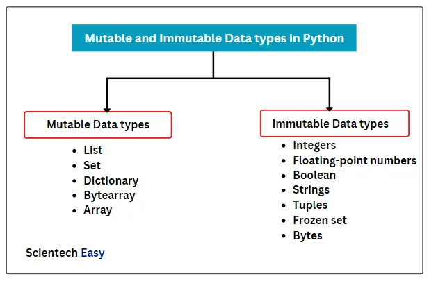

## 1. Python inner working

1. python code convert into byte code and then byte code go Python Virtual machine for execution
```
python code ---> byte code ---> Python Virtual Machine(executer)
```
- byte code is low level code 
- byte code is not machine code
- Python Virtual Machine --> Run time engine

.pyc --> compiled python
- it work only for imported files

. __pycache__ ----> for keep organize .pyc files


-----------

### 2.  mera sawal hai ke mien ne toh import file se chai function ko call kia tha toh sirf wohi function chalta lekin hello_chai.py file sari run ho gae ye kue?: 
### sol:  Jab Python kisi file ko import karta hai, toh wo uss file ko execute karta hai. Iska matlab hai ke hello_chai.py ka sara code chalega, chahe hum sirf ek function hi import karein.

----------

## Mutable And Immutable DataTypes in Python : 

----------
